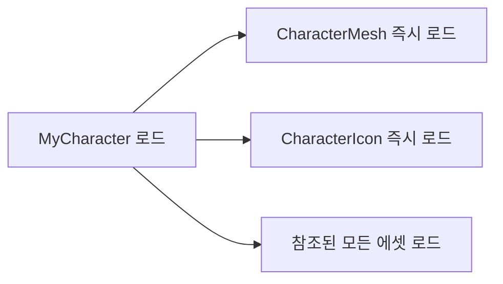

# Lyra의 데이터 기반 설계에 대하여 알아보자

김하연 튜터님의 Notion 자료를 바탕으로 강의를 들으며<br>
수정 및 재작성한 블로깅용 글<br>

실제 라이브 서비스에선 데이터 하나 바꾸는게 쉽진 않음<br>

Lyra는 데이터 기반 설계를 선택하며,<br>
여러 비전을 보여주었음<br>

## 1-1. 하드 레퍼런스 (Hard Reference)

### 정의: "내가 이거 쓸 거니까 미리 다 준비해놔"

```cpp
UCLASS()
class AMyCharacter : public ACharacter
{
    UPROPERTY(EditDefaultsOnly)
    USkeletalMesh* CharacterMesh;  // 하드 레퍼런스

    UPROPERTY(EditDefaultsOnly)
    UTexture2D* CharacterIcon;     // 이것도 하드 레퍼런스
};
```

우리가 흔히 쓰는 방식<br>

- 엔진이 이걸 본 순간, 안전하게 로딩하려고 빌드 방식을 변경<br>
  (이건 '반드시 메모리'에 올라와 있어야 한다!)<br>

### 동작 방식

하드 레퍼런스가 있는 오브젝트는 **해당 오브젝트가 로드되는 순간 연결된 모든 에셋이 즉시 메모리에 로드**




### 문제가 어떻게 발생할까?

```cpp
class AWarriorCharacter : public ACharacter
{
    UPROPERTY()
    USkeletalMesh* WarriorMesh;        // 50MB

    UPROPERTY()
    TArray<UTexture2D*> ArmorTextures; // 각 4MB × 10개 = 40MB

    UPROPERTY()
    TArray<USoundBase*> VoiceLines;    // 각 2MB × 20개 = 40MB

    UPROPERTY()
    UAnimationAsset* IdleAnimation;    // 10MB
    UAnimationAsset* WalkAnimation;    // 10MB
    UAnimationAsset* RunAnimation;     // 10MB
    // ... 더 많은 애니메이션들
};
```

- 하드 레퍼런스가 많아질수록<br>
  해당 객체가 더 많은 메모리를 잡아먹는다<br>
  (반드시 메모리에 계속 있어야 하므로)<br>

- 캐릭터 10명만 로드해도 1.6GB 사용! 콘솔/PC 메모리 바로 압박 시작 🤯<br>

| 캐릭터 구성 | 메모리 사용량 |
| --- | --- |
| SkeletalMesh | 50MB |
| Textures (10개) | 40MB |
| Sounds (20개) | 40MB |
| Animations (3개) | 30MB |
| **총합** | **160MB** |

당장 필요하지 않더라도<br>
메모리에 올려놓아야 함...<br>

- 그렇다고 하드 레퍼런스가 쓸모가 없을까??<br>
  : 아님<br>
  - 가장 안정적인 로드 방식임<br>
  - 매우 작은 용량의 에셋이라던가<br>
    항상 '필요'한 경우라면<br>
    고려가 가능함<br>
  - 괜히 soft로 했다가 비동기 로딩하는 것보다 훨씬 좋음<br>
    특히 UI 쪽에선 아주 중요한 문제<br>
    (특정 UI가 '잠시' 로딩이 안되는 것은 치명적인 문제임)<br>

- 캐릭터의 Mesh, 필수적인 Anim Montage 등<br>
  없으면(nullptr) 게임이 안돌아가는 경우에는 쓰는 편이 좋음<br>

- 객체 사용 시점에 '반드시' 로딩이 되기에<br>
  nullptr이 되면 안되는 경우라면 권장이 됨<br>
  (null Crash가 나면 안되는 경우에는 고려하자)<br>

- TSubclassof 역시 이와 비슷함<br>
  `타입 안정성`이 중요한 경우<br>
  즉 반드시 T를 상속받는 것이 필요하며,<br>
  컴파일 타임에 잡아내는 것이 필요하다면 고려 가능함<br>
  (TSoftClassof는 로딩 후에 발견이 가능함)<br>

- UI, 시스템 로직 과 같은 부분에서는<br>
  하드 레퍼런스를 사용하여, 안정성을 고려하는 것이 더 좋은 선택<br>

- Character 가 CharacterMovement를 사용하는 것은 당연함(엔진 기반)<br>
  (커스텀 캐릭터 + 커스텀 캐릭터 무브먼트 컴포넌트)<br>
  이런 것처럼 구조적인 녀석들도 하드 레퍼런스가 안전함<br>
  

## 1-2. 소프트 레퍼런스 (Soft Reference)

### 정의: "일단 파일 경로만 기억해두고, 필요할 때 가져올게"

```cpp
class ALyraCharacter : public ACharacter
{
    UPROPERTY(EditDefaultsOnly)
    TSoftObjectPtr<USkeletalMesh> CharacterMesh;  // 경로만 저장! (몇 바이트)

    UPROPERTY(EditDefaultsOnly)
    TSoftObjectPtr<UTexture2D> CharacterIcon;     // 경로만 저장! (몇 바이트)
};
```

- 메모리는 “몇 바이트”만 사용 (`경로 문자열`만 저장)<br>
- 에셋은 **절대 자동으로 로드되지 않음**<br>

진짜 로딩은 요청할때만 함<br>
(하드는 객체 생성 시, 바로 메모리 요구)<br>

- 필요할때마다 로딩하여 사용<br>
- 로드 시점을 제어해야 함<br>

### TSoftObjectPtr 구조 분석

- `T` = Template (템플릿) - "어떤 타입이든 가능"
- `Soft` = 소프트 레퍼런스 - "경로만 저장"
- `Object` = 언리얼 오브젝트 - "언리얼 에셋"
- `Ptr` = Pointer - "가리키는 것"

경로를 저장하되<br>
타입과 에셋을 지정하여 실제로 로딩할 때 해당 타입으로 가져올 수 있음<br>

### Asset Registry

`.uasset`<br>

에셋 이름 → 실제 파일 경로<br>

- Asset Registry를 통해<br>
  디스크에서 데이터를 로드한 후<br>
  메모리에 올리고 포인터를 반환<br>

## 1-3. 소프트 레퍼런스 사용법

### 방법 1: 동기 로드 (Synchronous)

```cpp
void ALyraCharacter::EquipCharacterMesh()
{
    // 경로 정보가 있는지 먼저 확인
    if (!CharacterMesh.IsNull())
    {
        // 경로에 해당하는 리소스를 즉시 로드!
        USkeletalMesh* LoadedMesh = CharacterMesh.LoadSynchronous();
        
        if (LoadedMesh)
        {
            GetMesh()->SetSkeletalMesh(LoadedMesh);
            UE_LOG(LogTemp, Log, TEXT("메시 로드 완료!"));
        }
    }
}
```

- LoadSynchronous<br>
  : 즉시 로딩하나 프리즈 함<br>

- 디스크에서 파일을 불러오는 동안<br>
  모든 게임 로직들이 멈추게 됨<br>

- 언리얼의 게임은 기본적으로 메인 스레드에서 돌아가게 됨<br>
  - 로딩하게 되면, ssd,hdd 까지 데이터 로딩할때까지 기다려야 함<br>
    (버스 언제 와...)<br>

**동기 로드 동작 = 로드가 다 끝날 때까지 게임이 멈춤 → ‘프리즈’ 발생**

```
게임: "메시 로드해줘!"
엔진: "로드 중... (5초)"
게임: 5초 동안 화면 멈춤 ㅋㅋㅋ
플레이어: "렉 걸리네?"
```

- Init 시점에 초기화하는 용도가 아니라면<br>
  비권장함<br>
  - 게임 성능은 한 프레임이 16ms 안에 끝나는 것을 권장하는 편<br>

- 화면에 로딩하는 UI 등을 통해 사용하는 편임<br>
  (UX에 영향을 적게 끼침)<br>

- 인게임 중에 이걸 쓰는 건...<br>

### 방법 2: 비동기 로드 (Asynchronous)

```cpp
void ALyraCharacter::EquipCharacterMeshAsync()
{
    if (!CharacterMesh.IsNull())
    {
        // AssetManager에게 "백그라운드에서 로드해줘!" 요청
        FStreamableManager& Streamable = UAssetManager::GetStreamableManager();
        
        UE_LOG(LogTemp, Log, TEXT("메시 로드 시작..."));
        
        Streamable.RequestAsyncLoad(
            CharacterMesh.ToSoftObjectPath(),
            FStreamableDelegate::CreateWeakLambda(this, [this]()
            {
                // 로드가 끝나면 이 부분이 실행돼요
                if (USkeletalMesh* LoadedMesh = CharacterMesh.Get())
                {
                    GetMesh()->SetSkeletalMesh(LoadedMesh);
                    UE_LOG(LogTemp, Log, TEXT("메시 로드 완료!"));
                }
                else
                {
                    UE_LOG(LogTemp, Error, TEXT("메시 로드 실패!"));
                }
            })
        );
    }
}
```

**비동기 로드 동작**

```
게임: "메시 로드해줘, 끝나면 알려줘"
엔진: "ㅇㅋ 백그라운드에서 할게"
게임: 안 멈춤
엔진: (5초 후) "로드 완료! 지금 적용할게"
플레이어: 올ㅋ
```

- 다른 스레드에게 로딩하도록 요청함<br>
  (Worker 스레드)<br>

- 로딩이 끝날 때, Delegate를 통해<br>
  메인 스레드는 Callback을 받음<br>

- Delegate용 함수를 통해<br>
  로딩이 끝나는 시점에 취할 행동 정의<br>

- 멀티 스레드 환경인 만큼 관련 옵션이 Thread-Safe 인지를 확인하는 것도 중요할 듯?<br>
  ex) 로딩 끝났을 때, 해당 포인터 등이 다 살아있는가?<br>
  (로딩이 끝나는 시점은 예상할 수 없기에, 항상 nullCheck 등도 필요함)<br>
  (CreateWeakLambda : this가 살아있는지를 체크)<br>

## 1-4. 소프트 레퍼런스 타입 비교

```cpp
// 에셋 파일 (path) 참조
TSoftObjectPtr<USkeletalMesh> MeshPath;        // 메시 파일 경로
TSoftObjectPtr<UTexture2D> TexturePath;        // 텍스처 파일 경로

// 클래스 타입 참조
TSoftClassPtr<AWeapon> WeaponClassPath;        // 무기 클래스 경로
TSoftClassPtr<UGameplayAbility> AbilityPath;   // 능력 클래스 경로
```

| 타입 | 용도 | 예시 |
| --- | --- | --- |
| `TSoftObjectPtr<T>` | 에셋 파일 | 메시, 텍스처, 사운드 |
| `TSoftClassPtr<T>` | 클래스 타입 | Actor, Game Ability Class |

- 에셋은 메시, 텍스쳐, 사운드 자체를 의미<br>
  (리소스 그 자체)<br>

- BP 등을 사용한다면 Class Ptr을 권장<br>
  (리소스를 사용하여 만들어진 실제 설계도)<br>

- 로딩의 결과물이 UObject / UClass 이냐의 차이<br>  
  (둘다 .uasset 기반)<br>

- 클래스가 참조하는 에셋이 너무 많다거나<br>
  데이터 기반으로 수정하기 편하게 하려면<br>
  TSoftClassPtr 을 고려할 수 있음<br>

```cpp
UCLASS()
class AWeaponSpawner : public AActor
{
    GENERATED_BODY()
    
public:
    UPROPERTY(EditDefaultsOnly, Category = "Weapon")
    TSoftClassPtr<AWeapon> WeaponClassToSpawn;
    
    UPROPERTY(EditAnywhere, Category = "Config")
    FName WeaponType;
    
    void SpawnWeapon()
    {
        // 1단계: 클래스 로드
        if (TSubclassOf<AWeapon> WeaponClass = WeaponClassToSpawn.LoadSynchronous())
        {
            // 2단계: 로드된 클래스로 인스턴스 생성
            AWeapon* NewWeapon = GetWorld()->SpawnActor<AWeapon>(
                WeaponClass,
                GetActorLocation(),
                GetActorRotation()
            );
            
            if (NewWeapon)
            {
                UE_LOG(LogTemp, Log, TEXT("무기 스폰 성공!"));
            }
        }
    }
};
```

- 이건 클래스를 동기 로드하는 방식이긴 함<br>

# 2. Asset Manager - 언리얼의 에셋 관리 🦡

- 규모가 커질수록 SoftObjectPtr 같은 소프트 레퍼런스만으로는 충분치 않음<br>
- 데이터 관리가 힘들어진다<br>
  - 일일이 클래스에 Ptr 넣어주고 그려려고?<br>
  - 유지보수가 박살<br>
  - 동기/비동기 일일이 코드에서 로드한다고...?<br>

- 위의 요소들은 '개별'적인 요소를 기반으로 한다<br>

- 안쓰는 에셋 메모리 판별은 소프트 레퍼런스가 해줄 수 없음<br>
  + 흩어져 있는 에셋을 관리하기 생각보다 어려움<br>

## 2-1. Primary Asset - AssetManager가 관리하는 중요 데이터

- 위의 여러 문제를 기반으로 등장한 AssetManager<br>

- Asset Registry : 경로만 저장<br>
  에셋 매니저는 여기에 '로딩 정책'과 '분류 정책'을 추가하여 전반적인 관리를 하게 됨<br>
  - 그렇다고 에셋 매니저가, 모든 '에셋'을 관리할 수 있는 것은 아님<br>
    (수만 개의 에셋을 일일이 추적하는 것이 불가능)<br>
    (모든 에셋이 아닌, `'특별'`하게 '중요'한 에셋만 '추적')<br>

- 이러한 '특별'하고 중요한 '에셋'이<br>
  `PrimaryDataAsset`<br>

- `AssetManager`가 “이 에셋은 특별히 관리해야 한다”고 인식시키려면 해당 에셋이 **UPrimaryDataAsset을 상속받아야 함.**<br>

```cpp
// Primary Asset으로 승격시키는 방법
class UWeaponDataAsset : public UPrimaryDataAsset  // 이 한 줄이 핵심!
{
    GENERATED_BODY()
    
public:
    // AssetManager가 식별할 수 있는 고유 ID 생성
    virtual FPrimaryAssetId GetPrimaryAssetId() const override
    {
        // Type: "Weapon", Name: DataAsset 파일 이름
        return FPrimaryAssetId(TEXT("Weapon"), GetFName());
    }
    
    // 소프트 레퍼런스 데이터
    UPROPERTY(EditDefaultsOnly)
    TSoftObjectPtr<USkeletalMesh> WeaponMesh;
    
    UPROPERTY(EditDefaultsOnly)
    TSoftObjectPtr<UTexture2D> WeaponIcon;
};
```

- **Primary Asset의 의미**
    - 게임 전역에서 언제든 식별 가능<br>
    - 패키징 시 필요한 에셋만 포함할 수 있게 제어<br>
    - 부분 로딩 (번들 로딩) 지원<br>
    → 즉, “게임을 데이터로 조립”할 수 있게 해주는 핵심 구조<br>

- Type과 name을 가지고 '구분'하는 용도로 사용<br>

- 에셋 매니저는 내부에 HashMap을 통해 각 <AssetId,FPrimaryAssetData>로 분류하고<br>
  상수시간 검색을 가능하도록 함<br>

- 특정 타입만 추출도 가능함<br>
  + 참조 카운트를 통해 에셋 데이터를 추적하여, 언로드도 해줌<br>

## 2-2. Bundle System - 필요한 파트만 부분적으로 로드하기

- 상황마다 필요한 리소스가 다를 수 있음<br>
  (ex : 특정 UI 리소스를 전부 로드하는게 아니라, `강화`용도 UI만 로드하고 싶음)<br>

- 서버에서는 메시 데이터 같은 것은 필요 없음<br>
  (어차피 클라에서만 보일테니)<br>

- Bundle은 Primary Asset 내부의 **에셋 그룹.** 언리얼에서 이름만 정의해두면 됨.<br>

### Bundle 정의

```cpp
namespace EAssetBundle
{
    const FName Menu("Menu");          // UI용 최소 데이터
    const FName Gameplay("Gameplay");  // 게임플레이 데이터
    const FName Visual("Visual");      // 3D 리소스
    const FName Audio("Audio");        // 사운드
}
```

특정 상황에서만 필요한 것들을 묶어놓음<br>

### 1단계: 캐릭터 선택 화면 (UI) 번들

```cpp
// 메뉴 번들만 로드 (가볍고 빠르게)
UAssetManager::Get().LoadPrimaryAsset(
    CharacterId, 
    {EAssetBundle::Menu}  // 썸네일, 이름, 설명만
);
```

### 2단계: 게임 시작 준비

- 이제 게임플레이에 필요한 스탯, 능력 정보가 필요함. 비주얼은 아직 로드 안함.

```cpp
// 메뉴 + 게임플레이 번들 로드
UAssetManager::Get().LoadPrimaryAsset(
    CharacterId, 
    {EAssetBundle::Menu, EAssetBundle::Gameplay}  // UI + 스탯 데이터
);
```

- 파라미터용 PrimaryDataAssetId와<br>
  번들을 통한 데이터 로딩<br>

### 3단계: 실제 월드에 스폰

- 비주얼 전체 로딩도 필요

```cpp
// 전체 번들 로드 (풀 세트!)
UAssetManager::Get().LoadPrimaryAsset(
    CharacterId, 
    {EAssetBundle::Menu, EAssetBundle::Gameplay, EAssetBundle::Visual}
);
```

### 거리 기반 별 최적화

```cpp
// 거리에 따른 적응적 로딩
if (Distance > 1000.0f)
{
    // 멀리: 게임플레이만 (AI 계산용)
    LoadPrimaryAsset(EnemyId, {EAssetBundle::Gameplay});
}
else if (Distance > 500.0f)
{
    // 중간: 게임플레이 + 비주얼
    LoadPrimaryAsset(EnemyId, {EAssetBundle::Gameplay, EAssetBundle::Visual});
}
else
{
    // 가까이: 모든 것 (사운드까지)
    LoadPrimaryAsset(EnemyId, {EAssetBundle::Gameplay, EAssetBundle::Visual, EAssetBundle::Audio});
}
```

### 프로젝트 설정

**Project Settings → Game → Asset Manager**

```
Primary Asset Types:
├── "Weapon"
│   ├── Base Class: UWeaponDataAsset
│   └── Directories: /Game/Data/Weapons
│   └── Bundles: Gameplay, Visual, Audio
│
├── "PawnData"
│   ├── Base Class: ULyraPawnData
│   └── Directories: /Game/Data/Pawns
│   └── Bundles: Gameplay, Visual
│
└── "Experience"
    ├── Base Class: ULyraExperienceDefinition
    └── Directories: /Game/Data/Experiences
    └── Bundles: Gameplay
```

## 2-3. 런타임 사용 - 진짜 게임에서 쓰기

```cpp
void APlayerCharacter::EquipWeaponByName(FName WeaponName)
{
    // 1단계: Primary Asset ID 만들기
    FPrimaryAssetId WeaponId(TEXT("Weapon"), WeaponName);
    
    // 2단계: Asset Manager 가져오기 (싱글톤)
    UAssetManager& AssetManager = UAssetManager::Get();
    
    // 3단계: 어떤 번들을 로드할지 결정
    TArray<FName> BundlesToLoad;
    BundlesToLoad.Add(FName("Client"));
    
    // 4단계: 비동기 로드 요청
    AssetManager.LoadPrimaryAsset(
        WeaponId,
        BundlesToLoad,
        FStreamableDelegate::CreateUObject(this, &APlayerCharacter::OnWeaponLoaded, WeaponId)
    );
    
    UE_LOG(LogTemp, Log, TEXT("무기 로딩 시작: %s"), *WeaponName.ToString());
}
```

- FPrimaryAssetId WeaponId(TEXT("Weapon"), WeaponName) 처럼<br>
  로딩용 에셋 아이디 지정<br>
  (Type + Name)<br>

```cpp
virtual FPrimaryAssetId GetPrimaryAssetId() 
const override 
{
     return FPrimaryAssetId(TEXT("Weapon"), GetFName());
}

UPROPERTY(EditDefaultsOnly, Category="Client", meta=(AssetBundles="Client"))
TSoftObjectPtr<USkeletalMesh> WeaponMesh;

UPROPERTY(EditDefaultsOnly, Category="Client", meta=(AssetBundles="Client"))
TSoftObjectPtr<UTexture2D> IconTexture;

// 서버 전용 로직용 데이터가 있다면
UPROPERTY(EditDefaultsOnly, Category="Server", meta=(AssetBundles="Server"))
TSoftObjectPtr<UCurveTable> DamageCurve;
```

- 이제 GetFName()까지 맞는 PrimaryDataAsset을 가져옴<br>
- 다만, 해당하는 에셋의 데이터 중, `meta=(AssetBundles="Client")`들만 로딩할 수 있음<br>

```cpp
void APlayerCharacter::OnWeaponLoaded(FPrimaryAssetId WeaponId)
{
    UE_LOG(LogTemp, Log, TEXT("무기 로딩 완료!"));
    
    // 5단계: 로드된 Primary Asset 가져오기
    UObject* LoadedObject = UAssetManager::Get().GetPrimaryAssetObject(WeaponId);
    
    UWeaponDefinition* WeaponDef = Cast<UWeaponDefinition>(LoadedObject);
    if (!WeaponDef)
    {
        UE_LOG(LogTemp, Error, TEXT("무기 데이터 캐스팅 실패!"));
        return;
    }
    
    // 6단계: 실제 적용
    ApplyWeaponToCharacter(WeaponDef);
}
```

# 3. 데이터 중심 설계의 3단계 진화 (Lyra의 방향성) ❤️‍🔥

## Level 1: 값 추출 (Value Extraction)

### 목표: 하드코딩된 숫자를 외부 데이터로 이동시키기

### 기존 문제점

```cpp
class AWeapon : public AActor
{
    float Damage = 100.0f;    // 코드에 박혀있음
    float FireRate = 0.5f;    // 바꾸려면 재컴파일
    float Range = 1000.0f;    // 디자이너가 못 바꿈
};
```

- 바꿀 때, 컴파일이 다시 되는 것은<br>
  디자이너가 수정을 '프로그래머'에게 요청해야 한다는 점임...<br>

### **Step 1: 구조체 정의 (DataTable Row)**

```cpp
USTRUCT(BlueprintType)
struct FWeaponStats : public FTableRowBase  // 중요! FTableRowBase 상속
{
    GENERATED_BODY()

    UPROPERTY(EditAnywhere)
    float Damage = 10.0f;

    UPROPERTY(EditAnywhere)
    float FireRate = 1.0f;

    UPROPERTY(EditAnywhere)
    float Range = 500.0f;
};
```

- csv 등을 사용하기 위한 데이터 테이블의 등장<br>

### **Step 2: CSV 파일 생성**

```
Name,Damage,FireRate,Range
Pistol,25,0.3,800
Rifle,40,0.1,1500
Shotgun,100,1.0,300
```

- csv를 통해 uasset을 변환하기 위함<br>

### **Step 3: 에디터에서 임포트**

1. CSV 파일을 Content Browser로 드래그
2. "DataTable" 선택
3. Row Structure에서 `FWeaponStats` 선택
4. Import!

### **Step 4: 코드에서 로드**

```cpp
class AWeapon : public AActor
{
    // 에디터에서 DataTable 연결
    UPROPERTY(EditDefaultsOnly)
    UDataTable* WeaponStatsTable;

    // 무기 종류
    UPROPERTY(EditAnywhere)
    FName WeaponType = "Pistol";

    // 실제 사용할 값들
    float Damage;
    float FireRate;
    float Range;

    void BeginPlay()
    {
        // DataTable이 있는지 확인
        if (WeaponStatsTable)
        {
            // WeaponType 이름으로 행 찾기
            FWeaponStats* Stats = WeaponStatsTable->FindRow<FWeaponStats>(
                WeaponType,
                TEXT("WeaponStats")  // 디버그용 컨텍스트
            );

            // 찾았으면 값 적용
            if (Stats)
            {
                Damage = Stats->Damage;
                FireRate = Stats->FireRate;
                Range = Stats->Range;
            }
        }
    }
};
```

- 코드에서 가져와서 데이터 적용<br>

### 결과: 디자이너가 CSV만 수정해도 즉시 밸런스 반영 가능

- 하드코딩된 데이터를 디자이너가 적용하도록 설정<br>

## Level 2: 동작 추상화 (Behavior Abstraction)

- GAS 시스템의 등장 배경<br>

### 목표: 행동 (Logic) 자체를 데이터로 교체

### 기존 문제점

```cpp
void AWeapon::Fire()
{
    if (WeaponType == "Pistol")      { /* 단발 */ }
    else if (WeaponType == "Rifle")  { /* 3점사 */ }
    else if (WeaponType == "Shotgun"){ /* 산탄 */ }
}
```

- 물론 이 방식을 클래스로 상속받을 수는 있음<br>

- 그러나 여전히 프로그래머가 해당 클래스들을 수정해야 함<br>

- 테스트 시, Fire의 전체를 실행하며<br>
  발사 방식을 수정하려면 결국 프로그래머의 수정이 다시 필요<br>

### 해결: DataAsset + Ability System 조합

GAS!<br>

- Lyra는 ‘동작’을 **Ability로 모델링함.**<br>

- Ability를 조합하여 '행동'을 정의하기<br>

- 무기가 어떤 방식으로 발사하는지조차 **데이터로 선택**할 수 있음.<br>

### **Step 1: WeaponDataAsset 정의**

```cpp
UCLASS(BlueprintType)
class UWeaponDataAsset : public UPrimaryDataAsset  // Primary Asset!
{
    GENERATED_BODY()

public:
    // 무기 기본 정보
    UPROPERTY(EditDefaultsOnly, Category = "Info")
    FText WeaponName;

    UPROPERTY(EditDefaultsOnly, Category = "Info")
    FText Description;

    // 발사 동작을 Ability로!
    UPROPERTY(EditDefaultsOnly, Category = "Combat")
    TSoftClassPtr<UGameplayAbility> PrimaryFireAbility;  // 주 발사

    UPROPERTY(EditDefaultsOnly, Category = "Combat")
    TSoftClassPtr<UGameplayAbility> SecondaryFireAbility; // 보조 발사

    // 비주얼
    UPROPERTY(EditDefaultsOnly, Category = "Visual")
    TSoftObjectPtr<UStaticMesh> WeaponMesh;

    // 애니메이션
    UPROPERTY(EditDefaultsOnly, Category = "Animation")
    TSoftObjectPtr<UAnimMontage> FireMontage;

    // 이펙트
    UPROPERTY(EditDefaultsOnly, Category = "Effects")
    TSoftObjectPtr<UNiagaraSystem> MuzzleFlash;

    // Primary Asset ID (Asset Manager가 관리)
    virtual FPrimaryAssetId GetPrimaryAssetId() const override
    {
        return FPrimaryAssetId(TEXT("Weapon"), GetFName());
    }
};

```

- 무기에 대한 데이터 정의<br>
- 데이터 에셋을 통해 하나의 '객체'에 필요한 데이터들을 관리<br>

### **Step 2: 발사 방식 Ability로 분리**

```cpp
// GA_Fire_Single.cpp - 단발 사격
UCLASS()
class UGA_Fire_Single : public UGameplayAbility
{
    void ActivateAbility(...)
    {
        // 한 발만 쏜다
        SpawnProjectile();
        PlayMontage(FireAnimation);
        SpawnMuzzleFlash();
    }
};

// GA_Fire_Burst.cpp - 3점사
UCLASS()
class UGA_Fire_Burst : public UGameplayAbility
{
    void ActivateAbility(...)
    {
        // 3발 연속 발사
        for (int i = 0; i < 3; i++)
        {
            SpawnProjectile();
            Wait(0.1f);
        }
    }
};
```

- 어빌리티를 별도로 구현<br>

### Step 3: 무기 장착 시 Ability + Visual 로딩

```cpp
void ACharacter::EquipWeapon(UWeaponDataAsset* WeaponData)
{
    if (!WeaponData) return;

    UE_LOG(LogTemp, Warning, TEXT("Equipping: %s"), *WeaponData->WeaponName.ToString());

    // 1. Ability 로드 및 부여
    if (!WeaponData->PrimaryFireAbility.IsNull())
    {
        // 소프트 레퍼런스 로드
        TSubclassOf<UGameplayAbility> AbilityClass =
            WeaponData->PrimaryFireAbility.LoadSynchronous();

        if (AbilityClass)
        {
            // 기존 발사 능력 제거
            if (CurrentFireAbilityHandle.IsValid())
            {
                AbilitySystemComponent->ClearAbility(CurrentFireAbilityHandle);
            }

            // 새 발사 능력 부여
            FGameplayAbilitySpec AbilitySpec(AbilityClass, 1, 0, this);
            CurrentFireAbilityHandle = AbilitySystemComponent->GiveAbility(AbilitySpec);

            UE_LOG(LogTemp, Warning, TEXT("Fire ability granted!"));
        }
    }

    // 2. 비주얼 로드
    if (!WeaponData->WeaponMesh.IsNull())
    {
        UStaticMesh* Mesh = WeaponData->WeaponMesh.LoadSynchronous();
        if (Mesh && WeaponMeshComponent)
        {
            WeaponMeshComponent->SetStaticMesh(Mesh);
        }
    }

    // 3. 애니메이션 저장
    if (!WeaponData->FireMontage.IsNull())
    {
        CurrentFireMontage = WeaponData->FireMontage.LoadSynchronous();
    }
}
```

### 결과: 발사 방식 추가 = Ability만 새로 만들고 DataAsset에서 연결만 바꾸면 끝!

- 이후, 신규 무기는 DataAsset을 만든 후,<br>
  Ability를 조합하여 만들 수 있음<br>

- 프로그래머의 인적 효율 증가!<br>

## Level 3: 정의의 데이터화 (Definition as Data)

- 게임 전체를 데이터로 관리해보자<br>
  Experience 시스템<br>

### 목표: 게임 전체를 데이터로 구성하기

### 계층 구조

```
🎮 Experience (게임 모드)
    ├── PawnData (캐릭터 정의)
    │   ├── ⚡ Abilities
    │   ├── 🎮 InputConfig
    │   └── 🔧 Components
    └── GameFeatures
```

- GameFeatures 플러그인을 통해<br>
  게임의 기능을 플러그인처럼 다양하게 분류하고<br>
  필요에 따라 로드/활성화<br>

- ActionSet<br>
  : 다양한 게임 규칙을 관리<br>
   (PrimaryDataAsset)<br>
   (Lyra에서 사용하는 구조적 개념)<br>
   (Experience 와 비슷)<br>

- Experience 를 통하여<br>
  현재 게임 상태와 이벤트 게임 상태<br>
  DLC 관리 등에 대하여 더 넓은 확장성이 높아질 수 있음<br>
  (극단적인 데이터 기반 설계는 아닐지라도 유용할 수 있음)<br>

### Step 1: Experience (게임 모드 정의)

- Lyra에서는 Experience에서 **맵 로딩 → GameFeature 활성화 → PawnData 적용 → UI 초기화까지** 전부 결정함.

```cpp
UCLASS()
class ULyraExperienceDefinition : public UPrimaryDataAsset
{
    GENERATED_BODY()

public:
    // 이 게임 모드의 이름
    UPROPERTY(EditDefaultsOnly, Category = "Info")
    FText ExperienceName;

    // 사용 가능한 캐릭터들
    UPROPERTY(EditDefaultsOnly, Category = "Gameplay")
    TMap<FGameplayTag, UPawnDataAsset*> AvailablePawns;

    // 게임 규칙
    UPROPERTY(EditDefaultsOnly, Category = "Rules")
    TSubclassOf<AGameMode> GameModeClass;

    // 추가 기능들 (리스폰, 점수, 스톰 등)
    UPROPERTY(EditDefaultsOnly, Category = "Features")
    TArray<FString> GameFeaturesToLoad;

    // UI
    UPROPERTY(EditDefaultsOnly, Category = "UI")
    TSoftClassPtr<UHUD> HUDClass;

    // 기본 맵
    UPROPERTY(EditDefaultsOnly, Category = "Level")
    TSoftObjectPtr<UWorld> DefaultMap;

    virtual FPrimaryAssetId GetPrimaryAssetId() const override
    {
        return FPrimaryAssetId(TEXT("Experience"), GetFName());
    }
};
```

- 다양한 데이터를 Experience안에 세팅<br>
  - 게임 모드를 매번 새로 만드는 것이 힘드므로<br>

### Step 2: PawnData (캐릭터 정의)

```cpp
UCLASS()
class UPawnDataAsset : public UPrimaryDataAsset
{
    GENERATED_BODY()

public:
    // 캐릭터 이름
    UPROPERTY(EditDefaultsOnly, Category = "Info")
    FText CharacterName;

    // 붙일 컴포넌트들 (8강에서 배운 그것!)
    UPROPERTY(EditDefaultsOnly, Category = "Components")
    TArray<TSoftClassPtr<UActorComponent>> Components;

    // 캐릭터 능력들
    UPROPERTY(EditDefaultsOnly, Category = "Abilities")
    TArray<TSoftClassPtr<UGameplayAbility>> Abilities;

    // 입력 설정
    UPROPERTY(EditDefaultsOnly, Category = "Input")
    UInputConfig* InputConfig;

    // 기본 스탯
    UPROPERTY(EditDefaultsOnly, Category = "Stats")
    float MaxHealth = 100.0f;

    UPROPERTY(EditDefaultsOnly, Category = "Stats")
    float MoveSpeed = 600.0f;

    virtual FPrimaryAssetId GetPrimaryAssetId() const override
    {
        return FPrimaryAssetId(TEXT("PawnData"), GetFName());
    }
};
```

- 선언할 PawnData<br>

### Step 3: Experience 선택 → AssetManager 로드

```cpp
void LoadExperience(FString ExperienceName)
{
    // Primary Asset ID로 찾기
    FPrimaryAssetId ExpId(TEXT("Experience"), ExperienceName);

    // Asset Manager에게 로드 요청
    UAssetManager& Manager = UAssetManager::Get();

    UE_LOG(LogTemp, Warning, TEXT("Loading experience: %s"), *ExperienceName);

    // 비동기 로드!
    Manager.LoadPrimaryAsset(ExpId, {},
        FStreamableDelegate::CreateLambda([this, ExpId]()
        {
            UE_LOG(LogTemp, Warning, TEXT("Experience loaded!"));
            OnExperienceLoaded(ExpId);
        })
    );
}
```

### Step 4: Experience 적용 - 로드된 Experience 적용

```cpp
void OnExperienceLoaded(FPrimaryAssetId ExpId)
{
    // 로드된 Experience 가져오기
    ULyraExperienceDefinition* Experience =
        UAssetManager::Get().GetPrimaryAssetObject<ULyraExperienceDefinition>(ExpId);

    if (!Experience)
    {
        UE_LOG(LogTemp, Error, TEXT("Failed to load experience!"));
        return;
    }

    // 1. 게임 규칙 적용
    UE_LOG(LogTemp, Warning, TEXT("Setting game mode..."));
    World->SetGameMode(Experience->GameModeClass);

    // 2. 사용 가능한 캐릭터 설정
    AvailableCharacters = Experience->AvailablePawns;
    UE_LOG(LogTemp, Warning, TEXT("Available characters: %d"),
        AvailableCharacters.Num());

    // 3. 게임 기능 활성화
    for (const FString& Feature : Experience->GameFeaturesToLoad)
    {
        UE_LOG(LogTemp, Warning, TEXT("Activating feature: %s"), *Feature);
        // GameFeature 활성화 코드
    }

    // 4. HUD 생성
    if (!Experience->HUDClass.IsNull())
    {
        TSubclassOf<UHUD> HUDClass = Experience->HUDClass.LoadSynchronous();
        // HUD 생성 코드
    }

    CurrentExperience = Experience;
}
```

### Step 5: PawnData 적용 - 플레이어가 캐릭터 선택

```cpp
void ApplyPawnData(ALyraCharacter* Character, UPawnDataAsset* PawnData)
{
    UE_LOG(LogTemp, Warning, TEXT("Applying PawnData: %s"),
        *PawnData->CharacterName.ToString());

    // 1. Component 붙이기 (8강에서 배운 내용!)
    for (TSoftClassPtr<UActorComponent> CompClass : PawnData->Components)
    {
        if (!CompClass.IsNull())
        {
            // 소프트 레퍼런스 로드
            TSubclassOf<UActorComponent> ComponentClass = CompClass.LoadSynchronous();

            if (ComponentClass)
            {
                // 컴포넌트 생성
                UActorComponent* NewComp = NewObject<UActorComponent>(
                    Character, ComponentClass
                );

                // 월드에 등록 (중요! 이거 안하면 BeginPlay 안 불림!)
                NewComp->RegisterComponentWithWorld(GetWorld());

                UE_LOG(LogTemp, Warning, TEXT("Component added: %s"),
                    *ComponentClass->GetName());
            }
        }
    }

    // 2. 능력 부여
    for (TSoftClassPtr<UGameplayAbility> AbilityClass : PawnData->Abilities)
    {
        if (!AbilityClass.IsNull())
        {
            TSubclassOf<UGameplayAbility> Ability = AbilityClass.LoadSynchronous();

            if (Ability)
            {
                Character->AbilitySystemComponent->GiveAbility(
                    FGameplayAbilitySpec(Ability, 1, INDEX_NONE, Character)
                );

                UE_LOG(LogTemp, Warning, TEXT("Ability granted: %s"),
                    *Ability->GetName());
            }
        }
    }

    // 3. 입력 설정
    if (PawnData->InputConfig)
    {
        Character->SetInputConfig(PawnData->InputConfig);
        UE_LOG(LogTemp, Warning, TEXT("Input config set!"));
    }

    // 4. 스탯 적용
    Character->SetMaxHealth(PawnData->MaxHealth);
    Character->SetMoveSpeed(PawnData->MoveSpeed);

    UE_LOG(LogTemp, Warning, TEXT("Character setup complete!"));
}
```

### 팀 데스매치

```
Experience: EXP_TeamDeathmatch
├── PawnData:
│   ├── DA_Assault (돌격병)
│   ├── DA_Sniper (저격수)
│   └── DA_Support (지원병)
├── GameMode: GM_TeamDeathmatch
└── Features: ["Respawn", "TeamScore"]

```

### 배틀로얄

```
Experience: EXP_BattleRoyale
├── PawnData:
│   └── DA_Default (기본 캐릭터)
├── GameMode: GM_BattleRoyale
└── Features: ["Storm", "Loot", "NoRespawn"]
```

# 4. 설계별 개발 방식 비교 📊

- 이러한 방식이 생산력이 증가된다는 점??<br>

- 데이터 기반 설계<br>
  -> 디자이너 등 타 직군의 요청에 대한 인적 소모가 감소하게 됨<br>

- 이는<br>
  프로그래머의 인적 효율 증가 -> 개발력 증가 -> 개발 시간 단축 -> 개발 비용 감소<br>
  -> 돈!<br>

## 시나리오 1: 새 무기 추가

### 상황: "크리스마스 이벤트용 눈송이 발사기를 추가해주세요!"

## 방식 1: 코드 중심 개발

- 기존 방식에서는 **새 무기 = 새 클래스 구현**
    
```cpp
// Step 1: C++ 클래스 생성 (30분)
class ASnowflakeLauncher : public AWeapon
{
    GENERATED_BODY()

public:
    // 하드코딩된 발사 로직
    virtual void Fire() override
    {
        for (int i = 0; i < 6; i++)
        {
            FVector Direction = GetRandomSnowflakeDirection();
            SpawnSnowflakeProjectile(Direction);
        }
    }

    // 특수 효과 하드코딩
    void SpawnSnowflakeEffect()
    {
        // 100줄의 이펙트 코드...
    }

    // 사운드 처리
    void PlaySnowflakeSound()
    {
        // 50줄의 사운드 코드...
    }
};
```
    
| 단계 | 작업 내용 |
| --- | --- |
| 1. C++ 클래스 작성 | ASnowflakeLauncher 클래스 생성 |
| 2. 발사 로직 구현 | 눈송이 패턴, 물리, 충돌 처리 |
| 3. 컴파일 | 전체 프로젝트 빌드 |
| 4. 블루프린트 생성 | BP_SnowflakeLauncher 제작 |
| 5. 에셋 연결 | 메시, 텍스처, 사운드 연결 |
| 6. 테스트/디버깅 | 버그 수정, 밸런싱 |

- **총 소요시간: 5시간**
- **필요 인력: 프로그래머 필수**
- **빌드 필요: O**
- **패치 크기: 수십 ~ 수백 MB**

## 방식 2: 데이터 중심 개발 (Lyra 방식)

### 작업 프로세스

```
Step 1: WeaponDataAsset 생성 (5분)
 → DA_Weapon_SnowflakeLauncher

Step 2: 기존 Ability 재사용/복사 (30분)
 → GA_Fire_Spread를 복사해 GA_Fire_Snowflake 제작
 → 발사 수/패턴만 조정

Step 3: DataAsset에서 에셋 연결 (5분)
 → PrimaryFireAbility = GA_Fire_Snowflake
 → Mesh / Sound / FX 드롭다운 선택
```

### DataAsset 설정

```cpp
// DA_Weapon_SnowflakeLauncher 에디터 설정
WeaponName: "Snowflake Launcher"
Description: "Spreads holiday cheer!"
PrimaryFireAbility: GA_Fire_Snowflake (Soft Reference)
WeaponMesh: SM_SnowflakeLauncher (Soft Reference)
MuzzleFlash: NS_SnowflakeSparkle (Soft Reference)
FireSound: SFX_SnowflakeLaunch (Soft Reference)
```

- **총 소요시간: 40분**
- **필요 인력: 디자이너 가능**
- **빌드 필요: X**
- **패치 크기: ~5MB (데이터만)**

## 시나리오 2: 밸런스 패치

### 상황: "샷건이 너무 강해요! 데미지, 산탄 개수, 퍼짐 각도를 조정해주세요"

## 방식 1: 코드 기반

```cpp
// Shotgun.cpp 파일 열기
class AShotgun : public AWeapon
{
    // 기존 값들
    float Damage = 90.0f;      // → 75.0f로 변경
    float SpreadAngle = 15.0f; // → 20.0f로 변경
    int PelletCount = 8;        // → 6으로 변경

    // 수정 후 필요한 작업:
    // 1. 파일 저장
    // 2. 컴파일 (10분)
    // 3. 에디터 재시작 (2분)
    // 4. 쿠킹/패키징 (20분)
    // 5. 패치 생성 (10분)
    // 6. 서버 배포 (15분)
    // 7. 클라이언트 패치 (500MB 다운로드)
};
```

### 작업 플로우


- **총 소요시간: 2시간**
- **플레이어 영향: 500MB 다운로드 필요**
- **서비스 중단: 가능성 있음**

## 방식 2: 데이터 기반 밸렁싱 (Lyra 방식)

### DataTable 수정 과정

```
// WeaponStats.csv 수정
Name,Damage,FireRate,Range,PelletCount,SpreadAngle
Pistol,25,0.3,800,1,0
Rifle,40,0.1,1500,1,0
Shotgun,75,1.0,300,6,20  // ← 이 행만 수정!
```

### 작업 플로우


**총 소요시간: 21초**

**플레이어 영향: 없음 (서버사이드)**

**서비스 중단: 없음**

### 밸런싱 반복 작업 비교

### 기존 방식 - 밸런스 조정 지옥

```
09:00 - "데미지 90 → 80으로"
09:10 - 코드 수정 시작
10:00 - 빌드 완료, 테스트
10:30 - "아직도 강해요, 75로"
10:40 - 코드 수정 시작...
11:30 - 빌드 완료, 테스트
12:00 - "이번엔 너무 약해요, 77로"
프로그래머: ㅋ
```

### Lyra 방식 - 실시간 밸런싱

```
09:00:00 - "데미지 90 → 80으로"
09:00:10 - CSV 수정, 저장
09:00:20 - 테스트 "아직 강해요"
09:00:30 - "75로 수정"
09:00:40 - 테스트 "너무 약해요"
09:00:50 - "77로 수정"
09:01:00 - "완벽해요!"
프로그래머: 저는 신규 기능 개발할게요 ^^
```

## 시나리오 3: 이벤트 모드 추가

### 상황: "할로윈 좀비 모드를 2주 안에 만들어주세요!"

## 방식 1: 코드 기반 추가

### 필요한 새 클래스들

```cpp
// 1. GameMode 클래스 (750줄)
class AHalloweenZombieMode : public AGameMode
{
    // 좀비 스폰 시스템 (200줄)
    void SpawnZombieWave(int WaveNumber);
    void CalculateZombieCount(int Players);
    void SetZombieSpawnPoints();

    // 웨이브 관리 시스템 (300줄)
    void StartWave(int WaveNum);
    void EndWave();
    void CheckWaveCompletion();

    // 특수 규칙 (150줄)
    void ApplyNightVision();
    void EnableBarricadeSystem();
    void ManagePowerUps();

    // UI 관리 (100줄)
    void UpdateWaveUI();
    void ShowZombieCounter();
};

// 2. 캐릭터 클래스들
class AZombieCharacter : public ACharacter
{
    // 좀비 AI (300줄)
    // 좀비 애니메이션 (200줄)
    // 좀비 능력 (150줄)
};

class ASurvivorCharacter : public ACharacter
{
    // 생존자 특수 능력 (200줄)
    // 바리케이드 시스템 (150줄)
};

// 3. 추가 시스템들
class ABarricadeActor : public AActor { /* 200줄 */ };
class APowerUpActor : public AActor { /* 150줄 */ };
class AWaveManager : public UObject { /* 300줄 */ };
```

### 작업 분배

| 작업 | 담당 |
| --- | --- |
| GameMode 클래스 | 시니어 프로그래머 |
| 좀비 AI | AI 프로그래머 |
| 캐릭터 클래스 | 게임플레이 프로그래머 |
| UI 시스템 | UI 프로그래머 |
| 테스트/디버깅 | QA 팀 |
| 밸런싱 | 기획팀 |

**총 작업: 3-4일 (팀 전체)**

**코드량: 2000줄+**

**필요 인력: 4-5명**

## 방식 2: 데이터 조합 중심 (Lyra 방식)

### Experience 생성 과정

```yaml
# EXP_HalloweenZombie.yaml (개념적 표현)
ExperienceName: "Halloween Zombie Survival"
GameMode: GM_Survival  # 기존 서바이벌 모드 재사용!

AvailablePawns:
  Player: DA_Pawn_Survivor
  AI: DA_Pawn_Zombie

GameFeatures:  # 기존 기능 조합!
  - "WaveSystem"      # 이미 있는 웨이브 시스템
  - "NightMode"       # 이미 있는 야간 모드
  - "BarricadeSystem" # 이미 있는 바리케이드
  - "PowerUpSystem"   # 이미 있는 파워업

HUD: HUD_Survival  # 기존 서바이벌 HUD 재사용

EnvironmentSettings:
  TimeOfDay: Night
  FogDensity: High
  AmbientSound: "Halloween_Ambient"
```

### PawnData 설정

```yaml
# DA_Pawn_Zombie
CharacterName: "Zombie"
Components:
  - HealthComponent (MaxHealth: 50)
  - AIComponent (Behavior: Aggressive)
  - MeleeComponent (Damage: 20)
Abilities:
  - GA_ZombieBite
  - GA_ZombieSprint
MoveSpeed: 300
```

```yaml
# DA_Pawn_Survivor
CharacterName: "Survivor"
Components:
  - HealthComponent (MaxHealth: 100)
  - InventoryComponent
  - BuildComponent
Abilities:
  - GA_BuildBarricade
  - GA_UseFlashlight
  - GA_ThrowGrenade
MoveSpeed: 450
```

### 실제 작업 시간

| 작업 | 소요 시간 | 방법 |
| --- | --- | --- |
| Experience 생성 | 5분 | 에디터에서 DataAsset 생성 |
| GameMode 설정 | 5분 | 기존 Survival 모드 선택 |
| PawnData 설정 | 10분 | 컴포넌트/능력 조합 |
| GameFeatures 연결 | 10분 | 체크박스로 선택 |
| 환경 설정 | 5분 | 파라미터 조정 |
| 테스트 | 5분 | 즉시 플레이 가능 |

**총 작업: 40분**

**코드 작성: 0줄**

**필요 인력: 1명 (디자이너)**